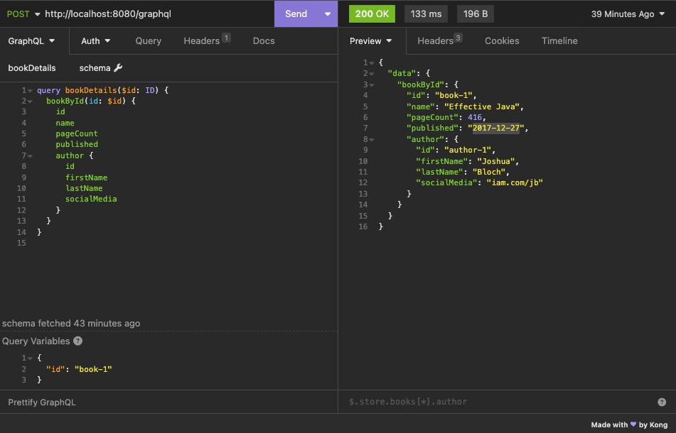

# spring-boot-graphql-kotlin
Based on [this guide](https://spring.io/guides/gs/graphql-server/) but using kotlin. Also works with spring boot v2.x.x
Original source [here](https://github.com/spring-guides/gs-graphql-server/tree/main/complete).

Supports custom scalars by using the [graphql-java-extended-scalars](https://github.com/graphql-java/graphql-java-extended-scalars) library. Also supports string alias types.

